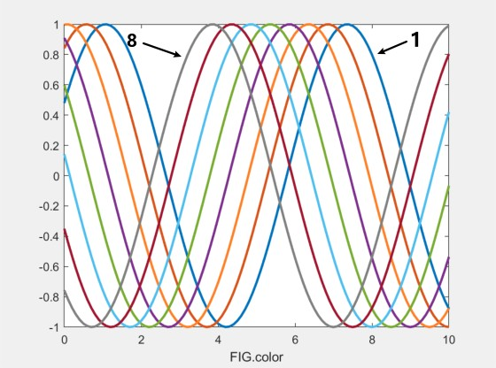
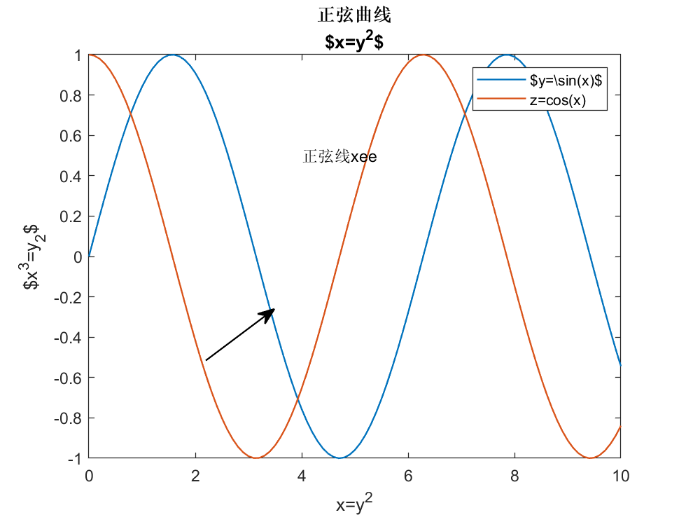
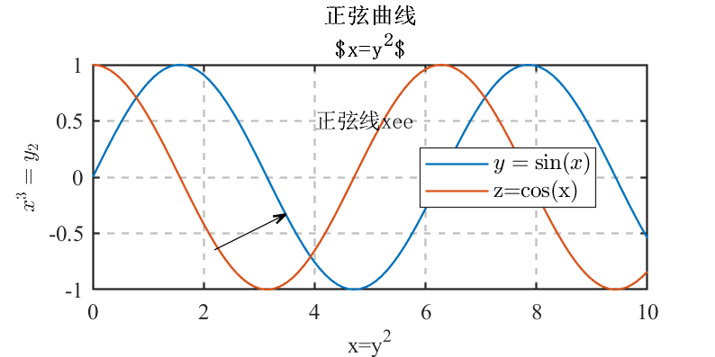

# Matlab 绘图后处理

- 一键实现图片位置、大小、字体、背景、网格、标注等设置
- 导出pdf

## 类属性

`color`: 自定义颜色表, 已预定义8种颜色, 低版本 Matlab 用此画图更美观

```matlab
plot(x, y, 'color', FIG.color(n,:))
```

其中 n=1:8



## 类方法

### 方法 1 —— 设置图片的宽度、宽高比、文字大小等

```matlab
FIG.figSetting(fig, width, ratio, 'FontSize', 10, 'FontSizeIn',10, 'Journal', 'acess')
```

- `fig`(必选): 图片句柄, 当前图片可用 gcf 传入
- `width`(可选): 图像宽度/cm，默认 8
- `ratio`(可选): 图像高宽比，默认 0.75, 即默认高度 6cm
- `FontSize`(可选, name-value,下同): 坐标轴标注文字字号大小，默认10.5/五号
- `FontSizeIn`: 图内文字(legend,text)字号大小，默认10.5/五号
- `Journal`: 内置期刊名，提前定义好图片尺寸、图片文字的字体字号，目前只定义了`acess`,`mythesis`

其他默认设置

- 字体，中文统一宋体，英文数字统一`'Times New Roman'`
- 背景透明
- 网格开启，线型--，透明度0.3
- 四边框开启
- legend： 边框显示，白色背景，线宽0.5，位置'best'
- 箭头：头宽5，头长6，'vback3'风格

举例

```matlab
x = 0:0.1:10;
y = sin(x);
z = cos(x);
plot(x, [y; z])

title({'正弦曲线';'$x=y^2$'}) %todo bug
xlabel('x=y^2')
ylabel('$x^3=y_2$')
legend('$y=\sin(x)$', 'z=cos(x)') %fixed, $只有放在第一个表达式，才能解析出来

text(4, 0.5, '正弦线xee')
annotation('arrow')

FIG.figSetting(gcf, 12, 0.5)
```

设置前

设置后


### 方法 2 —— 保存图片为 pdf

```matlab
FIG.savepdf(fig, filename, filepath)
```

- `fig`: 图片句柄
- `filename`(可选参数): 保存文件名字符串，默认为 `MySavedFile`
- `filepath`(可选参数): 保存文件的路径，默认为系统桌面

### TODO

- bug: 标题换行且中文与 latex 表达式同时出现
- bug: legend同时出现 tex 与 latex 表达式
